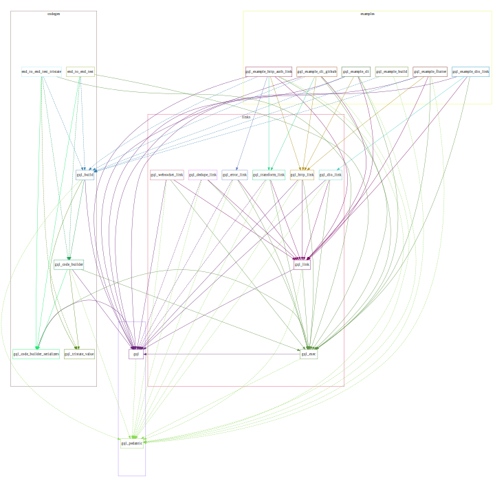

## `gql-dart/gql` 

[![MIT License][license-badge]][license-link]
[![PRs Welcome][prs-badge]][prs-link]
[![Watch on GitHub][github-watch-badge]][github-watch-link]
[![Star on GitHub][github-star-badge]][github-star-link]
[![Watch on GitHub][github-forks-badge]][github-forks-link]
[![Discord][discord-badge]][discord-link]

[license-badge]: https://img.shields.io/github/license/gql-dart/gql.svg?style=for-the-badge
[license-link]: https://github.com/gql-dart/gql/blob/master/LICENSE
[prs-badge]: https://img.shields.io/badge/PRs-welcome-brightgreen.svg?style=for-the-badge
[prs-link]: https://github.com/gql-dart/gql/issues

[github-watch-badge]: https://img.shields.io/github/watchers/gql-dart/gql.svg?style=for-the-badge&logo=github&logoColor=ffffff
[github-watch-link]: https://github.com/gql-dart/gql/watchers
[github-star-badge]: https://img.shields.io/github/stars/gql-dart/gql.svg?style=for-the-badge&logo=github&logoColor=ffffff
[github-star-link]: https://github.com/gql-dart/gql/stargazers
[github-forks-badge]: https://img.shields.io/github/forks/gql-dart/gql.svg?style=for-the-badge&logo=github&logoColor=ffffff
[github-forks-link]: https://github.com/gql-dart/gql/network/members

[discord-badge]: https://img.shields.io/discord/559455668810153989.svg?style=for-the-badge&logo=discord&logoColor=ffffff
[discord-link]: https://discord.gg/NryjpVa


This is an effort to advance the Dart GraphQL ecosystem.

It consists of multiple packages and libraries centered around GraphQL AST.



#### Core

The core of this project is the GraphQL parser which parses GraphQL strings into an AST. The parsed AST can then be transformed, visited and printed back to GraphQL string.

| Pub | Package | Library | Description |
|-----|---------|---------|-------------|
| [![version][package:gql:version]][package:gql] | [`package:gql`][package:gql:source] | `ast.dart` | GraphQL AST implementation with Visitor pattern and AST transformer |
| [![version][package:gql:version]][package:gql] | [`package:gql`][package:gql:source] | `language.dart` | GraphQL source parser and printer. Recognizes both operations and SDL |
| [![version][package:gql:version]][package:gql] | [`package:gql`][package:gql:source] | `document.dart` | Document and schema validation |

#### Code generation

GraphQL language enables code generation to speed up development and move document processing to build-time.
  
We provide code builders to generate Dart source code and file builders which easily plug into standard Dart code generation pipeline.

Ideas for future work:
- Typed resolvers for field resolution on the client or server

| Pub | Package | Library | Description |
|-----|---------|---------|-------------|
| [![version][package:gql_code_builder:version]][package:gql_code_builder] | [`package:gql_code_builder`][package:gql_code_builder:source] |  | Various builders |
| [![version][package:gql_build:version]][package:gql_build] | [`package:gql_build`][package:gql_build:source] |  | File builders |

#### Client

To enable development of GraphQL clients, we provide type definitions used to execute GraphQL operations. They include AST-based operation, request with per operation context, and response. These types are used by the Links.

Link is the current client implementation. Link is GraphQL AST-aware request/response middleware. They can be used to build a pipeline to deduplicate requests, conditionally transform requests and responses (including the context), and eventually send the requests to the server.

Ideas for future work:
- websocket link for subscriptions
- batched request HTTP link
- retry link to handle network issues transparently
- link for client-side request resolution 

| Pub | Package | Library | Description |
|-----|---------|---------|-------------|
| [![version][package:gql_exec:version]][package:gql_exec] | [`package:gql_exec`][package:gql_exec:source] | `gql_exec.dart` | Implementation of types for GraphQL requests and responses |
| [![version][package:gql_link:version]][package:gql_link] | [`package:gql_link`][package:gql_link:source] | `link.dart` | Base for modular GraphQL execution interface |
| [![version][package:gql_http_link:version]][package:gql_http_link] | [`package:gql_http_link`][package:gql_http_link:source] | `gql_http_link.dart` | Link to execute GraphQL requests via HTTP |
| [![version][package:gql_dedupe_link:version]][package:gql_dedupe_link] | [`package:gql_dedupe_link`][package:gql_dedupe_link:source] | `gql_dedupe_link.dart` | De-duplicating Link to avoid execution of identical requests |
| [![version][package:gql_transform_link:version]][package:gql_transform_link] | [`package:gql_transform_link`][package:gql_transform_link:source] | `gql_transform_link.dart` | GQL Link to transform Requests and Responses. May be used to update context, document, variables, data, errors, etc. |
| [![version][package:gql_websocket_link:version]][package:gql_websocket_link] | [`package:gql_websocket_link`][package:gql_websocket_link:source] | `gql_websocket_link.dart` | GQL Link for subscriptions using websocket. |
| [![version][package:gql_dio_link:version]][package:gql_dio_link] | [`package:gql_dio_link`][package:gql_dio_link:source] | `gql_dio_link.dart` | Similar to gql_http_link, A GQL Terminating Link to execute requests via Dio using JSON. |

#### Other

| Pub | Package | Library | Description |
|-----|---------|---------|-------------|
| [![version][package:gql_pedantic:version]][package:gql_pedantic] | [`package:gql_pedantic`][package:gql_pedantic:source] |  | Lint rules used by all `gql-dart/gql` packages |

#### Examples

| Pub | Package | Library | Description |
|-----|---------|---------|-------------|
| [![version][package:gql_example_cli:version]][package:gql_example_cli] | [`package:gql_example_cli`][package:gql_example_cli:source] |  | Example usage in a CLI environment |
| [![version][package:gql_example_flutter:version]][package:gql_example_flutter] | [`package:gql_example_flutter`][package:gql_example_flutter:source] |  | Example usage in a Flutter environment |


[package:gql:source]: ./gql/README.md
[package:gql]: https://pub.dartlang.org/packages/gql
[package:gql:version]: https://img.shields.io/pub/v/gql.svg?style=flat-square 
[package:gql_exec:source]: ./links/gql_exec/README.md
[package:gql_exec]: https://pub.dartlang.org/packages/gql_exec
[package:gql_exec:version]: https://img.shields.io/pub/v/gql_exec.svg?style=flat-square
[package:gql_websocket_link]: https://pub.dartlang.org/packages/gql_websocket_link
[package:gql_websocket_link:source]: ./links/gql_websocket_link/README.md
[package:gql_websocket_link:version]: https://img.shields.io/pub/v/gql_websocket_link.svg?style=flat-square
[package:gql_dio_link]: https://pub.dartlang.org/packages/gql_dio_link
[package:gql_dio_link:source]: ./links/gql_dio_link/README.md
[package:gql_dio_link:version]: https://img.shields.io/pub/v/gql_dio_link.svg?style=flat-square
[package:gql_link:source]: ./links/gql_link/README.md
[package:gql_link]: https://pub.dartlang.org/packages/gql_link
[package:gql_link:version]: https://img.shields.io/pub/v/gql_link.svg?style=flat-square 
[package:gql_http_link:source]: ./links/gql_http_link/README.md
[package:gql_http_link]: https://pub.dartlang.org/packages/gql_http_link
[package:gql_http_link:version]: https://img.shields.io/pub/v/gql_http_link.svg?style=flat-square 
[package:gql_code_builder:source]: ./codegen/gql_code_builder/README.md
[package:gql_code_builder]: https://pub.dartlang.org/packages/gql_code_builder
[package:gql_code_builder:version]: https://img.shields.io/pub/v/gql_code_builder.svg?style=flat-square 
[package:gql_build:source]: ./codegen/gql_build/README.md
[package:gql_build]: https://pub.dartlang.org/packages/gql_build
[package:gql_build:version]: https://img.shields.io/pub/v/gql_build.svg?style=flat-square 
[package:gql_dedupe_link:source]: ./links/gql_dedupe_link/README.md
[package:gql_dedupe_link]: https://pub.dartlang.org/packages/gql_dedupe_link
[package:gql_transform_link:version]: https://img.shields.io/pub/v/gql_transform_link.svg?style=flat-square 
[package:gql_transform_link:source]: ./links/gql_transform_link/README.md
[package:gql_transform_link]: https://pub.dartlang.org/packages/gql_transform_link
[package:gql_dedupe_link:version]: https://img.shields.io/pub/v/gql_dedupe_link.svg?style=flat-square 
[package:gql_pedantic:source]: ./gql_pedantic/README.md
[package:gql_pedantic]: https://pub.dartlang.org/packages/gql_pedantic
[package:gql_pedantic:version]: https://img.shields.io/pub/v/gql_pedantic.svg?style=flat-square
[package:gql_example_cli:source]: ./examples/gql_example_cli/README.md
[package:gql_example_cli]: https://pub.dartlang.org/packages/gql_example_cli
[package:gql_example_cli:version]: https://img.shields.io/pub/v/gql_example_cli.svg?style=flat-square 
[package:gql_example_flutter:source]: ./examples/gql_example_flutter/README.md
[package:gql_example_flutter]: https://pub.dartlang.org/packages/gql_example_flutter
[package:gql_example_flutter:version]: https://img.shields.io/pub/v/gql_example_flutter.svg?style=flat-square 


## Users

| Project | Description |
|---------|-------------|
| [artemis][artemis] | Build dart types from GraphQL schemas and queries (using Introspection Query). | 
| [graphql][graphql_flutter] | A stand-alone GraphQL client for Dart, bringing all the features from a modern GraphQL client to one easy to use package. |
| [graphql_flutter][graphql_flutter] | A GraphQL client for Flutter, bringing all the features from a modern GraphQL client to one easy to use package. |
| [normalize][normalize] | Normalization and denormalization of GraphQL responses in Dart |
| [ferry][ferry] | GraphQL Client for Dart |
| Your project? | Open a PR to add it to this readme! |

[artemis]: https://github.com/comigor/artemis
[graphql_flutter]: https://github.com/zino-app/graphql-flutter
[normalize]: https://github.com/smkhalsa/normalize
[ferry]: https://github.com/gql-dart/ferry

## Contributing

The goal of this project is to expand Dart GraphQL ecosystem
and to build a community around this vendor-neutral implementation.

Community contributions are welcome.

### `multipack`
This repo uses [`multipack`](https://github.com/gql-dart/multipack). To activate it run the following command.
```bash
pub global activate multipack
```

`multipack` provides a simple way of running commands in multiple packages at once. It builds a directed graph of packages
to run commands in topological order.

Link all local packages by running
```bash
multipack pubspec override
```

Get all packages by running
```bash
multipack pub get
```

Clean up the pubspec file before publishing
```bash
multipack pubspec clean
```

See more usage examples in [.github/workflows/dart.yml](.github/workflows/dart.yml).

## Features and bugs

Please file feature requests and bugs at the [GitHub][tracker].

[tracker]: https://github.com/gql-dart/gql/issues
