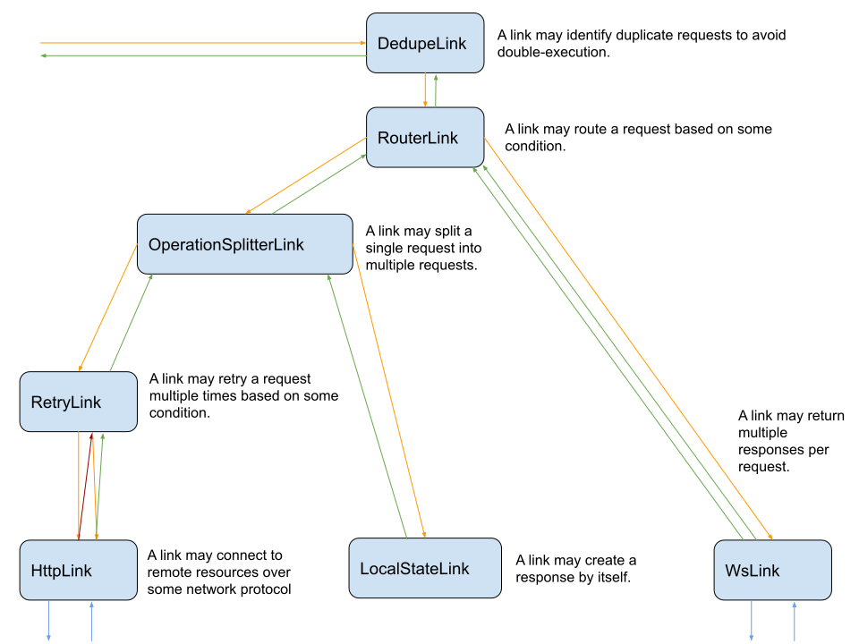

[![MIT License][license-badge]][license-link]
[![PRs Welcome][prs-badge]][prs-link]
[![Watch on GitHub][github-watch-badge]][github-watch-link]
[![Star on GitHub][github-star-badge]][github-star-link]
[![Watch on GitHub][github-forks-badge]][github-forks-link]
[![Discord][discord-badge]][discord-link]

[license-badge]: https://img.shields.io/github/license/gql-dart/gql.svg?style=for-the-badge
[license-link]: https://github.com/gql-dart/gql/blob/master/LICENSE
[prs-badge]: https://img.shields.io/badge/PRs-welcome-brightgreen.svg?style=for-the-badge
[prs-link]: https://github.com/gql-dart/gql/issues

[github-watch-badge]: https://img.shields.io/github/watchers/gql-dart/gql.svg?style=for-the-badge&logo=github&logoColor=ffffff
[github-watch-link]: https://github.com/gql-dart/gql/watchers
[github-star-badge]: https://img.shields.io/github/stars/gql-dart/gql.svg?style=for-the-badge&logo=github&logoColor=ffffff
[github-star-link]: https://github.com/gql-dart/gql/stargazers
[github-forks-badge]: https://img.shields.io/github/forks/gql-dart/gql.svg?style=for-the-badge&logo=github&logoColor=ffffff
[github-forks-link]: https://github.com/gql-dart/gql/network/members

[discord-badge]: https://img.shields.io/discord/559455668810153989.svg?style=for-the-badge&logo=discord&logoColor=ffffff
[discord-link]: https://discord.gg/NryjpVa

A modular AST-based GraphQL request execution interface.




## Setting up a link

There are multiple ways to set up your link by using other links.
Read more [here](https://pub.dev/documentation/gql_link/latest/link/Link-class.html).

Here's a simple example using `Link.from`:
```dart
import "package:gql_link/gql_link.dart";
import "package:gql_dedupe_link/gql_dedupe_link.dart";
import "package:gql_http_link/gql_http_link.dart";

import "./my_custom_link.dart";

void main () {
  final link = Link.from([
    MyCustomLink(),
    DedupeLink()
    HttpLink("/graphql"),
  ]);
}
```

To use a link to execute GraphQL operations, it must have been set up to end with a terminating link.
In this case, it's `HttpLink`.

## Using a link

When your link is set up, your GraphQL operation must be wrapped in a `Request` and executed via `link.request(request)`;

## Implementing a custom link

Links are designed to be composable. If you need to add a custom behavior, you can implement your own `Link`
by extending the `Link` class. If you prefer functions over classes, you can use `LinkFunction` together with `Link.function`.
If you have to route a request to some other links based on some set of conditions, `Link.route(LinkRouter route)`
might be what you need.

## Features and bugs

Please file feature requests and bugs at the [GitHub][tracker].

[tracker]: https://github.com/gql-dart/gql/issues
